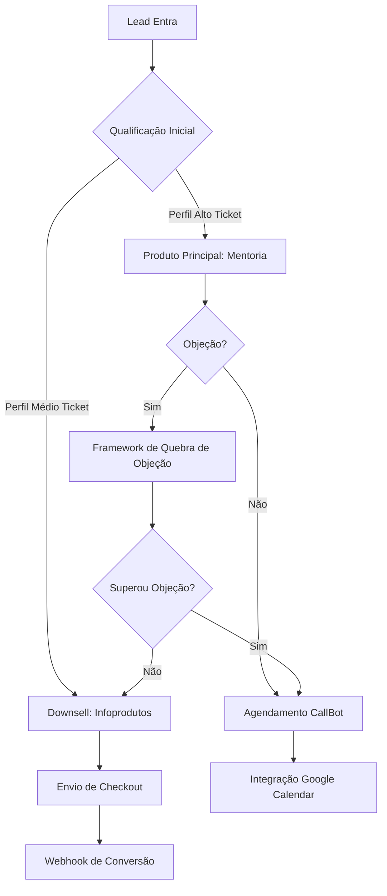

# ESCOPO TÉCNICO: DESENVOLVIMENTO DE AGENTE SDR CONVERSACIONAL COM IA

## DOCUMENTO DE ESPECIFICAÇÃO TÉCNICA v1.0

---

## 1. VISÃO GERAL DO SISTEMA

### 1.1 Objetivo
Desenvolvimento de um **Sales Development Representative (SDR) Autônomo** baseado em **Large Language Models (LLMs)** com integração multicanal, focado na automatização do ciclo completo de qualificação, tratamento de objeções e conversão de vendas via WhatsApp Business API.

### 1.2 Arquitetura Macro
```
┌─────────────────┐      ┌──────────────────┐      ┌─────────────────┐
│  WhatsApp API   │◄────►│  Orchestration   │◄────►│   CRM Odoo      │
│   (Evolution    │      │     Engine       │      │   (REST API)    │
│     API)        │      │  (LangChain/     │      │                 │
└─────────────────┘      │   LangGraph)     │      └─────────────────┘
                         └──────────────────┘
                                  │
                    ┌─────────────┴─────────────┐
                    │                           │
            ┌───────▼────────┐          ┌──────▼────────┐
            │  Vector Store  │          │  Dashboard    │
            │  (Pinecone/    │          │  (React/Next  │
            │   Supabase)    │          │   + Supabase) │
            └────────────────┘          └───────────────┘
```

### 1.3 Stack Tecnológica Recomendada

**Backend (Orquestração e IA):**
- **Runtime:** Node.js 20+ / Python 3.11+
- **Framework:** LangChain/LangGraph para orquestração de agentes
- **LLM Provider:** OpenAI GPT-4o / Anthropic Claude 3.5 Sonnet
- **Vector Database:** Pinecone / Supabase pgvector para RAG
- **Message Queue:** Redis/BullMQ para processamento assíncrono
- **Cache Layer:** Redis para state management e rate limiting

**WhatsApp Integration:**
- **Provider:** Evolution API v2 / Baileys (open-source)
- **Protocol:** WebSocket para realtime + REST API para comandos

**Frontend (Dashboard):**
- **Framework:** Next.js 14+ (App Router)
- **UI Library:** shadcn/ui + Tailwind CSS
- **State Management:** Zustand / Jotai
- **Real-time:** Supabase Realtime / WebSockets
- **Data Fetching:** React Query / SWR

**Database & Storage:**
- **Primary DB:** PostgreSQL 15+ (Supabase hosted)
- **File Storage:** S3-compatible (Supabase Storage / MinIO)
- **Session Management:** Redis (TTL-based ephemeral state)

**CRM Integration:**
- **Target System:** Odoo 16+ (Community/Enterprise)
- **Integration Method:** XML-RPC API / REST API (via Odoo modules)

---

## 2. ESTRATÉGIA DE VENDAS E FLUXO CONVERSACIONAL

### 2.1 Modelo de Vendas: Value Ladder com Adaptive Downsell



### 2.2 Produtos e Estratégias

| Produto | Categoria | Estratégia | Output |
|---------|-----------|-----------|--------|
| **Mentoria/Oratória** | High-Ticket | Consultiva + BANT | Link de Agendamento (Calendly/Cal.com) |
| **Infoproduto 1** | Mid-Ticket | Script de Benefícios | Checkout Stripe/Hotmart |
| **Infoproduto 2** | Mid-Ticket | Urgência + Escassez | Checkout Stripe/Hotmart |
| **Infoproduto 3** | Low-Ticket | Gatilho de Reciprocidade | Checkout Stripe/Hotmart |
| **Infoproduto 4** | Low-Ticket | Última Chance (Abandono) | Checkout Stripe/Hotmart |

### 2.3 Knowledge Base & Retrieval-Augmented Generation (RAG)

**Estrutura da Base de Conhecimento:**
```
knowledge_base/
├── scripts/
│   ├── openings.md              # Abordagens iniciais
│   ├── objection_handling.md    # Tratamento de objeções (LAER)
│   ├── closing_techniques.md    # Técnicas de fechamento
│   └── downsell_transitions.md  # Scripts de transição
├── brand_voice/
│   ├── tone_guidelines.md       # Tom de voz (casual/profissional)
│   ├── terminology.md           # Jargões e linguagem da marca
│   └── banned_phrases.md        # Expressões proibidas
└── training_data/
    ├── successful_convos.jsonl  # Conversas de sucesso (fine-tuning)
    └── failure_analysis.jsonl   # Análise de falhas
```

**Técnica de RAG:**
- **Embedding Model:** text-embedding-3-large (OpenAI) ou voyage-02
- **Chunking Strategy:** Recursive Character Splitter (500 tokens, 100 overlap)
- **Retrieval:** Top-K=5 com Maximal Marginal Relevance (MMR)
- **Reranking:** Cohere Rerank v3 ou BGE Reranker

---

## 3. INTERFACE ADMINISTRATIVA (DASHBOARD)

### 3.1 Arquitetura do Dashboard

**Padrão de Design:** Micro-frontends com Server Components (Next.js)

**Páginas Principais:**
```
/dashboard
  ├── /kanban              # Visualização do funil
  ├── /conversations       # Histórico de conversas
  ├── /analytics           # Métricas e KPIs
  ├── /knowledge-base      # Gestão da base de conhecimento
  └── /settings            # Configurações do agente
```

### 3.2 Visualização Kanban

**Colunas do Funil:**
1. **Novos Leads** (Não Qualificados)
2. **Em Qualificação** (Agente ativo)
3. **Agendamento Pendente** (Awaiting Calendar Confirmation)
4. **Venda Realizada** (Checkout concluído)
5. **Perdido** (Objeção não superada)

**Features Técnicas:**
- **Drag & Drop:** react-beautiful-dnd ou @dnd-kit
- **Real-time Updates:** Supabase Realtime Subscriptions
- **Optimistic UI:** Atualização local instantânea + sync server
- **Infinite Scroll:** Virtualização com react-window

### 3.3 Monitoramento em Tempo Real

**WebSocket Connection:**
```javascript
// Pseudocódigo de conexão
const subscription = supabase
  .channel('conversations')
  .on('postgres_changes', 
    { event: 'INSERT', schema: 'public', table: 'messages' },
    (payload) => {
      updateConversationUI(payload.new);
    }
  )
  .subscribe();
```

**Indicadores Visuais:**
- 🟢 Agente ativo respondendo
- 🟡 Lead digitando (via Evolution API typing status)
- 🔴 Aguardando resposta do lead (>5min inativo)
- ⚪ Takeover ativo (humano no controle)

### 3.4 Takeover Mode (Intervenção Humana)

**Implementação Técnica:**
```typescript
interface TakeoverSession {
  conversationId: string;
  agentPaused: boolean;
  humanAgentId: string;
  pausedAt: timestamp;
  resumeConditions: {
    manual: boolean;        // Humano clica em "Devolver ao Bot"
    timeout: number;        // Auto-retorno após X minutos de inatividade
    triggerPhrase: string;  // Palavra-chave para retorno (ex: "/bot")
  };
}
```

**Fluxo:**
1. Vendedor clica em "Assumir Conversa"
2. Sistema define flag `agent_paused = true` no Redis
3. Próximas mensagens do lead são roteadas para o dashboard (não processadas pelo LLM)
4. Vendedor digita via interface web (enviado via Evolution API)
5. Ao finalizar, clica em "Devolver ao Bot" ou sistema retorna automaticamente após timeout

### 3.5 Métricas de Performance (Analytics)

**KPIs Primários:**
- **Conversion Rate (CR):** `(Vendas Fechadas / Leads Entrantes) * 100`
- **Average Ticket:** `Total Revenue / Número de Vendas`
- **Response Time:** Mediana de latência entre pergunta do lead e resposta do agente
- **Objection Overcome Rate:** `(Objeções Superadas / Total Objeções) * 100`
- **Takeover Rate:** `(Intervenções Humanas / Total Conversas) * 100`

**Stack de Analytics:**
- **Data Warehouse:** PostgreSQL com tabelas agregadas
- **Visualização:** Tremor React / Recharts
- **Export:** CSV/Excel via ExcelJS ou SheetJS

---

## 4. INTEGRAÇÕES DE SISTEMA

### 4.1 CRM Odoo - Integração via API

**Protocolo:** XML-RPC (padrão Odoo) ou REST API (via módulo `restful`)

**Endpoints Críticos:**

| Operação | Endpoint/Método | Payload | Response |
|----------|----------------|---------|----------|
| **Criar Lead** | `create('crm.lead', {...})` | `{name, phone, source, stage_id}` | `lead_id` |
| **Atualizar Stage** | `write('crm.lead', [id], {...})` | `{stage_id: 3}` | `true/false` |
| **Criar Atividade** | `create('mail.activity', {...})` | `{res_model, res_id, summary, note}` | `activity_id` |
| **Log de Conversa** | `message_post()` | `{body: "Conversa resumida"}` | `message_id` |

**Implementação com odoo-xmlrpc (Node.js):**
```javascript
const Odoo = require('odoo-xmlrpc');

const odoo = new Odoo({
  url: 'https://your-odoo.com',
  db: 'your_db',
  username: 'admin',
  password: 'api_key'
});

async function createLead(leadData) {
  return await odoo.execute('crm.lead', 'create', [{
    name: leadData.name,
    phone: leadData.phone,
    source_id: 5, // WhatsApp
    stage_id: 1,  // Novo Lead
    user_id: 2,   // Atribuir ao vendedor
    team_id: 1    // Time de vendas
  }]);
}
```

### 4.2 Gestão de Pipeline Automatizada

**Mapeamento de Status:**

| Status Interno | Stage Odoo | Trigger |
|----------------|-----------|---------|
| `new` | Novo Lead (stage_id: 1) | Primeira mensagem recebida |
| `qualifying` | Em Qualificação (stage_id: 2) | Agente inicia conversa |
| `scheduled` | Agendamento Marcado (stage_id: 3) | Link de calendário clicado |
| `won` | Venda Ganha (stage_id: 4) | Webhook de pagamento confirmado |
| `lost` | Venda Perdida (stage_id: 5) | Lead não responde 48h |

**Implementação com State Machine:**
```typescript
enum LeadStatus {
  NEW = 'new',
  QUALIFYING = 'qualifying',
  SCHEDULED = 'scheduled',
  WON = 'won',
  LOST = 'lost'
}

async function updateLeadStage(leadId: string, newStatus: LeadStatus) {
  const stageMapping = {
    [LeadStatus.NEW]: 1,
    [LeadStatus.QUALIFYING]: 2,
    [LeadStatus.SCHEDULED]: 3,
    [LeadStatus.WON]: 4,
    [LeadStatus.LOST]: 5
  };
  
  await odoo.write('crm.lead', [leadId], {
    stage_id: stageMapping[newStatus]
  });
  
  // Log no histórico
  await odoo.message_post('crm.lead', leadId, {
    body: `Status alterado para: ${newStatus}`,
    message_type: 'notification'
  });
}
```

### 4.3 Registro de Histórico (Activity Logging)

**Estratégia de Armazenamento:**
- **Resumo Executivo:** Salvo no Odoo (via `mail.message`)
- **Transcrição Completa:** Salva no Supabase (referência via external_id)

**Geração de Resumo com LLM:**
```typescript
async function generateConversationSummary(messages: Message[]) {
  const prompt = `Resumir a seguinte conversa de vendas em 3-5 bullet points focando em:
  - Necessidades expressas pelo lead
  - Objeções levantadas
  - Próximos passos acordados
  
  Conversa:
  ${messages.map(m => `${m.role}: ${m.content}`).join('\n')}`;
  
  const summary = await openai.chat.completions.create({
    model: 'gpt-4o-mini',
    messages: [{ role: 'user', content: prompt }],
    temperature: 0.3
  });
  
  return summary.choices[0].message.content;
}
```

---

## 5. REQUISITOS NÃO-FUNCIONAIS E SEGURANÇA

### 5.1 Humanização Avançada (NLP & Behavioral Simulation)

**Técnicas de Humanização:**

1. **Typing Delay Simulation:**
```typescript
function calculateTypingDelay(message: string): number {
  const avgWPM = 60; // Palavras por minuto
  const words = message.split(' ').length;
  const baseDelay = (words / avgWPM) * 60 * 1000; // milissegundos
  const variance = baseDelay * 0.3; // ±30% de variação
  return baseDelay + (Math.random() * variance * 2 - variance);
}

async function sendHumanizedMessage(to: string, message: string) {
  const delay = calculateTypingDelay(message);
  
  // Envia status "digitando"
  await evolutionAPI.sendPresenceUpdate(to, 'composing');
  
  // Aguarda delay simulado
  await new Promise(resolve => setTimeout(resolve, delay));
  
  // Envia mensagem
  await evolutionAPI.sendText(to, message);
  
  // Remove status "digitando"
  await evolutionAPI.sendPresenceUpdate(to, 'paused');
}
```

2. **Padrões Linguísticos Naturais:**
   - Uso de interjeições contextuais ("Entendi!", "Ah, perfeito!", "Hmm...")
   - Variação de estrutura frasal (evitar respostas robotizadas repetitivas)
   - Erros intencionais ocasionais (typo seguido de correção)
   - Uso de emojis calculado (1-2 por mensagem em contextos apropriados)

3. **Contextual Tone Adaptation:**
```typescript
const toneProfiles = {
  casual: {
    formality: 0.3,
    emoji_frequency: 0.6,
    slang_allowed: true,
    sentence_length: 'short'
  },
  professional: {
    formality: 0.8,
    emoji_frequency: 0.2,
    slang_allowed: false,
    sentence_length: 'medium'
  },
  enthusiastic: {
    formality: 0.5,
    emoji_frequency: 0.8,
    exclamation_rate: 0.4,
    sentence_length: 'varied'
  }
};
```

### 5.2 Protocolos Anti-Bloqueio (Anti-Ban Strategy)

**Infraestrutura de Proteção:**

1. **Rotação de IP/Proxy:**
   - **Provider:** Bright Data / Oxylabs / Proxyrack
   - **Rotação:** A cada 50 mensagens ou 1 hora (o que ocorrer primeiro)
   - **Geolocalização:** IPs residenciais brasileiros

2. **Gestão de Warm-up:**
```typescript
interface WarmupSchedule {
  day1: { max_messages: 20, interval_minutes: 15 },
  day2: { max_messages: 40, interval_minutes: 12 },
  day3: { max_messages: 70, interval_minutes: 10 },
  day4: { max_messages: 100, interval_minutes: 8 },
  day5_onwards: { max_messages: 150, interval_minutes: 5 }
}

async function enforceWarmup(accountAge: number) {
  const schedule = getScheduleForDay(accountAge);
  const todayMsgCount = await redis.get(`msg_count:${accountAge}`);
  
  if (todayMsgCount >= schedule.max_messages) {
    throw new Error('Limite diário de warm-up atingido');
  }
  
  // Força intervalo entre mensagens
  await rateLimiter.wait(schedule.interval_minutes * 60 * 1000);
}
```

3. **Rate Limiting Inteligente:**
   - **Token Bucket Algorithm:** 150 mensagens/hora padrão
   - **Adaptive Throttling:** Reduz taxa se detectar lentidão do WhatsApp
   - **Per-Conversation Limit:** Máx. 15 mensagens em 5 minutos por lead

4. **Account Health Monitoring:**
```typescript
interface AccountHealth {
  bannedCount: number;
  warningCount: number;
  messageDeliveryRate: number; // % de mensagens entregues
  responseRate: number;        // % de leads que respondem
  lastHealthCheck: timestamp;
}

async function evaluateAccountHealth(phoneId: string): Promise<AccountHealth> {
  const metrics = await collectMetrics(phoneId);
  
  if (metrics.messageDeliveryRate < 0.85) {
    await alerting.send('Low delivery rate detected', phoneId);
    await pauseAccount(phoneId, '24h');
  }
  
  return metrics;
}
```

### 5.3 Escalabilidade e Performance

**Arquitetura de Processamento:**

```
┌─────────────────────┐
│  Incoming Messages  │
└──────────┬──────────┘
           │
    ┌──────▼──────┐
    │ Load Balancer │
    │   (Nginx)     │
    └──────┬────────┘
           │
    ┌──────▼──────────────────────┐
    │   Message Queue (Redis)     │
    │  ┌─────┐ ┌─────┐ ┌─────┐   │
    │  │ Q1  │ │ Q2  │ │ Q3  │   │
    │  └─────┘ └─────┘ └─────┘   │
    └──────┬──────────────────────┘
           │
    ┌──────▼──────────┐
    │   Workers (N8N/  │
    │   Custom Node)   │
    │  [3-10 instances]│
    └──────┬───────────┘
           │
    ┌──────▼──────┐
    │  LLM API    │
    │  (OpenAI)   │
    └─────────────┘
```

**Especificações de Servidor:**

| Componente | Recursos Mínimos | Recursos Recomendados |
|------------|------------------|----------------------|
| **App Server** | 2 vCPU, 4GB RAM | 4 vCPU, 8GB RAM |
| **Database (PostgreSQL)** | 2 vCPU, 4GB RAM, 50GB SSD | 4 vCPU, 8GB RAM, 100GB SSD |
| **Redis** | 1 vCPU, 2GB RAM | 2 vCPU, 4GB RAM |
| **Worker Nodes** | 2 vCPU, 4GB RAM (×3) | 4 vCPU, 8GB RAM (×5) |

**Benchmarks de Performance:**
- **Latência de Resposta:** < 3s (P95)
- **Throughput:** 100+ conversas simultâneas
- **Message Processing Rate:** 500+ mensagens/minuto
- **Uptime SLA:** 99.5%

### 5.4 Segurança e Compliance

**Proteções Implementadas:**

1. **Autenticação & Autorização:**
   - JWT tokens com refresh mechanism
   - Role-Based Access Control (RBAC) no dashboard
   - API Keys com rate limiting para webhooks

2. **Criptografia:**
   - TLS 1.3 para todas as comunicações
   - Encryption at rest para dados sensíveis (AES-256)
   - Webhook signatures (HMAC-SHA256)

3. **LGPD/GDPR Compliance:**
   - Consentimento explícito para armazenamento de dados
   - Right to erasure (delete account + conversation history)
   - Data retention policy (90 dias para conversas sem venda)

4. **Auditoria:**
   - Logs imutáveis de todas as ações (append-only log)
   - Webhook events para auditoria externa
   - IP whitelisting para acessos administrativos

---

## 6. ENTREGÁVEIS E CRONOGRAMA SUGERIDO

### Fase 1: MVP (4-6 semanas)
- [ ] Integração WhatsApp (Evolution API) + processamento básico de mensagens
- [ ] Agente LLM com prompt engineering inicial (produto principal apenas)
- [ ] Dashboard básico (Kanban + Visualização de conversas)
- [ ] Integração Odoo (create lead + update stage)

### Fase 2: Humanização e Downsell (2-3 semanas)
- [ ] Typing delays e padrões de humanização
- [ ] Lógica de downsell automático (4 infoprodutos)
- [ ] RAG com base de conhecimento
- [ ] Takeover mode (intervenção humana)

### Fase 3: Anti-Ban e Escalabilidade (2-3 semanas)
- [ ] Rotação de IP/Proxy
- [ ] Warm-up scheduler
- [ ] Rate limiting e health monitoring
- [ ] Load testing e otimizações

### Fase 4: Analytics e Refinamento (2 semanas)
- [ ] Dashboards de métricas
- [ ] A/B testing de scripts
- [ ] Fine-tuning do modelo com histórico de conversas
- [ ] Documentação técnica completa

---

## 7. RISCOS E MITIGAÇÕES

| Risco | Probabilidade | Impacto | Mitigação |
|-------|---------------|---------|-----------|
| Ban do WhatsApp | Média | Crítico | Warm-up rigoroso, rotação de IPs, múltiplas linhas |
| Latência alta do LLM | Baixa | Alto | Caching de respostas, fallback para templates |
| Falha na integração Odoo | Média | Médio | Retry mechanism, fila de sincronização |
| Leads percebem que é bot | Alta | Alto | Humanização avançada, takeover proativo |
| Overfitting do RAG | Média | Médio | Diverse training data, regular updates |

---

## 8. MÉTRICAS DE SUCESSO

**KPIs Técnicos:**
- ✅ Uptime > 99.5%
- ✅ Response time < 3s (P95)
- ✅ Message delivery rate > 95%
- ✅ Takeover rate < 10% (indicador de autonomia do agente)

**KPIs de Negócio:**
- ✅ Conversion Rate > 8% (benchmark: SDR humano ~5-7%)
- ✅ Cost per Lead (CPL) redução de 40%
- ✅ Lead Response Time < 30s
- ✅ Customer Satisfaction Score (CSAT) > 4.2/5

---

## ANEXOS

### A. Glossário Técnico
- **RAG:** Retrieval-Augmented Generation
- **BANT:** Budget, Authority, Need, Timeline (framework de qualificação)
- **LAER:** Listen, Acknowledge, Explore, Respond (tratamento de objeções)
- **TTL:** Time To Live (tempo de expiração de cache)
- **P95:** Percentil 95 (95% das requisições abaixo do valor)

### B. Referências Técnicas
- LangChain Documentation: https://python.langchain.com/
- Evolution API: https://github.com/EvolutionAPI/evolution-api
- Odoo XML-RPC: https://www.odoo.com/documentation/16.0/developer/misc/api/odoo.html

### C. Tech Stack Alternatives
- **LLM:** GPT-4o → Claude 3.5 Sonnet → Gemini 1.5 Pro
- **Vector DB:** Pinecone → Supabase pgvector → Weaviate
- **WhatsApp:** Evolution API → Baileys → Twilio API
- **CRM:** Odoo → HubSpot → Pipedrive
